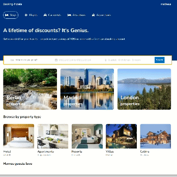

<h1 align="center" > Tech-Blog </h1>
 

    
    

#  📝 Descrição do projeto

    O aplicativo de reservas de hotel oferece uma plataforma simples e segura para encontrar e reservar acomodações em várias cidades. Com ele, os usuários podem selecionar o destino desejado e as datas da estadia, visualizar uma lista de hotéis disponíveis e comparar comodidades e preços antes de fazer sua escolha.

Além disso, o aplicativo permite que os usuários façam reservas de quartos diretamente, com o custo total calculado automaticamente com base no número de dias e tipo de quarto selecionado. Para os administradores, há um painel de controle onde podem gerenciar usuários, hotéis e quartos, adicionando novas propriedades, definindo preços e monitorando as reservas.

