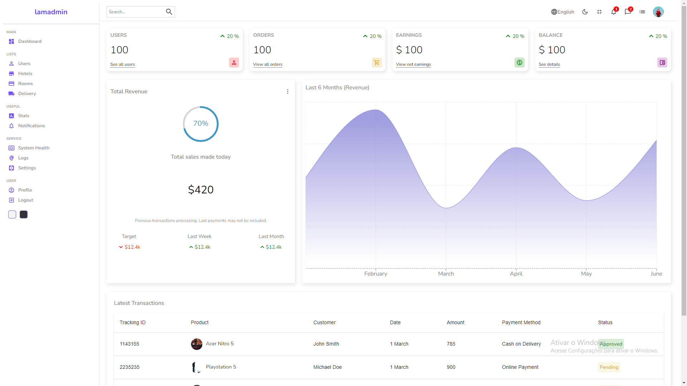

<h1 align="center" > Booking Reservation </h1>
<br>

<p align="center">    
    
</p>

#  📝 Descrição do projeto
<p>
    O aplicativo de reservas de hotel oferece uma plataforma simples e segura para encontrar e reservar acomodações em várias cidades. Com ele, os usuários podem selecionar o destino desejado e as datas da estadia, visualizar uma lista de hotéis disponíveis e comparar comodidades e preços antes de fazer sua escolha.

Além disso, o aplicativo permite que os usuários façam reservas de quartos diretamente, com o custo total calculado automaticamente com base no número de dias e tipo de quarto selecionado. Para os administradores, há um painel de controle onde podem gerenciar usuários, hotéis e quartos, adicionando novas propriedades, definindo preços e monitorando as reservas.
</p>

<br>

<h1 align="center"> Painel Administrador </h1>



<p>O painel de administração do aplicativo de reservas de hotel oferece controle total sobre o sistema. Os administradores podem gerenciar usuários, adicionar e editar informações de hotéis e quartos, além de acompanhar as reservas feitas pelos usuários. Essa ferramenta simplifica e agiliza a gestão do aplicativo, garantindo uma operação eficiente e personalizada.</p>

##Pré-requisitos
Antes de prosseguir com a instalação e execução do projeto, você precisa garantir que algumas configurações estejam feitas em sua máquina.

1. Variáveis de Ambiente
Certifique-se de criar duas variáveis de ambiente:

STRING DE CONEXÃO COM O MONGODB: Substitua esta variável pelo endereço de conexão com o seu banco de dados MongoDB.

Token JWT: Substitua esta variável pelo seu token JWT para autenticação.

2. Instalação do Node.js e NPM
Certifique-se de ter o Node.js instalado em seu sistema. O NPM é distribuído junto com o Node.js, portanto, ao instalar o Node.js, você automaticamente obtém o NPM. Você pode baixar o Node.js no site oficial do Node.js. Siga as instruções de instalação apropriadas para o seu sistema operacional.

3. Verificando a Instalação do NPM
Após instalar o Node.js, verifique se o NPM está instalado corretamente digitando o seguinte comando no seu terminal ou prompt de comando:

bash
Copy code
npm -v
Isso exibirá a versão atual do NPM instalada em seu sistema. Se o comando retornar a versão do NPM, significa que a instalação foi bem-sucedida e você está pronto para começar a usar o NPM.


Executando o Projeto
Para executar o projeto e ter acesso ao painel de administração, siga os seguintes passos:

Certifique-se de ter todas as variáveis de ambiente configuradas corretamente.
Execute o servidor.
Utilize Postman, Insomnia ou ferramenta similar para fazer uma requisição POST para a rota ```bash
 POST 'http://localhost:PORT/api/auth/register'```
 
No corpo da requisição, adicione os campos username, email e password.
Após criar o usuário, acesse o MongoDB e defina o campo isAdmin como true para ter acesso ao painel administrativo.


## 🚀 Tecnologias e bibliotecas

Esse projeto está sendo desenvolvido com as seguintes tecnologias:

Front-end
- React.JS
- Axios
- Sass
- React-router-dom
- Icons-material
- x-data-grid
- Recharts
- react-circular-progressbar

Back-end
- NodeJS
- Express
- Nodemon
- Bcrypt
- Cookie-parser
- Json Web Token
- mongoose

Banco de dados: <br>
-MongoDB


